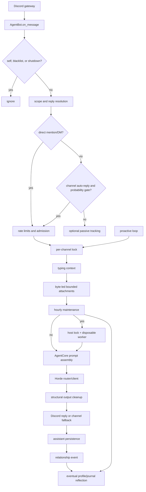

# Architecture and runtime flow

## Boundaries

Discord Agent Lite has four active boundaries:

1. **Discord boundary** — receives gateway events, resolves reply references,
   decides whether a turn is admitted, shows typing, and publishes one reply.
2. **Continuity boundary** — stores bounded conversation records and separate
   agent-authored social state in SQLite.
3. **Prompt/provider boundary** — assembles a card-native prompt and sends it
   to an eligible AI Horde text worker; image captions use Alchemist.
4. **Delivery boundary** — removes model transport artifacts and enforces the
   single-message Discord delivery contract without judging whether prose is
   sufficiently charming or in character.



## Startup and shutdown

`agentbot.__main__` calls `app.run()`. Startup loads `Settings`, then the
configured `Character`, then `MemoryStore`, and finally constructs `AgentBot`.
A missing token, invalid setting, unreadable card, unsupported provider, or
schema newer than the runtime fails before the Discord client is started.

`AgentBot.setup_hook()` creates one shared `aiohttp` session, wires the Horde
provider and optional Alchemist path, constructs `AttachmentProcessor` and
`AgentCore`, registers the slash-command cog, synchronizes commands, and
starts the proactive and maintenance loops. The gateway uses guild/message
content intents with a small Discord cache and no member cache.

Shutdown stops accepting new work, cancels loops and active events, closes the
core/provider/session, closes SQLite, and uses bounded cleanup steps plus a
watchdog if a cancellation-resistant task does not finish.

## Inbound state machine

Every Discord message follows one of these states:

```text
gateway event
  -> ignored (self/blacklist/shutdown)
  -> tracked-only (ambient message that is not admitted)
  -> admitted (direct or probabilistic auto-reply)
  -> locked (one active generation per channel)
  -> processing (typing + attachments + privacy snapshot)
  -> generated (AgentCore + Horde)
  -> delivered (reply, or channel.send fallback)
  -> persisted (only if privacy revision is still current)
  -> social queued (only for eligible direct events)
  -> reflected (eventual atomic profile/journal update)
```

An explicit bot mention or managed bot-role mention is direct. A DM is direct
when `RESPOND_TO_DMS=true`; disabled DMs are ignored. A guild reply with
Discord's `@` toggle on is direct, while a reply with `@` off is ordinary
ambient traffic and must pass the auto-reply gate. The reply reference still
supplies context in either case. Peer bots and webhooks are ordinary authors;
only this bot's own messages are categorically ignored.

The admission order is deliberate: identity/blacklist checks, scope and reply
resolution, direct/ambient decision, privacy state, user/channel/global rate
limits, request-slot admission, then the channel lock. Attachment work never
starts for a declined or lock-timeout turn.

## Proactive state machine

The hourly (configurable) loop only considers channels with saved proactive
configuration. A candidate must have send permission, stored external
participant activity older than the idle threshold, available daily quota, no
active cooldown, and participant activity newer than the previous proactive
post.

Before generation, inside the same channel lock, and immediately before send,
the loop rechecks the activity timestamp and requires the channel's latest
Discord message ID to be present in the exact SQLite scope. This prevents
startup/missed-message context leaks and prevents two bot posts from chaining
without a participant reply. New activity while generation runs cancels the
pending post. A sweep posts at most once.

## Module map

| Module | Responsibility | Active? |
| --- | --- | --- |
| `app.py` | Gateway events, admission, locks, typing, delivery, proactivity, maintenance, lifecycle | Yes |
| `commands.py` | `/agent`, `/memory`, `/profile`, and `/privacy` commands | Yes |
| `character.py` | Plain and `chara_card_v2` loading, bounded fields, lore matching | Yes |
| `orchestrator.py` | Prompt assembly, context fitting, replies, proactivity, reflection scheduling | Yes |
| `memory.py` | Schema-8 SQLite, scopes, CRUD, revisions, pruning, migration | Yes |
| `social.py` | Reflection parsing, provenance, secret/instruction-shaped text checks, relationship math | Yes |
| `policy.py` | Input cleanup, explicit-memory extraction, output structural cleanup, diagnostics, limiters | Yes |
| `prompt_formats.py` | ChatML, Llama 3, Mistral/Tekken, Gemma, and Alpaca rendering | Yes |
| `horde_client.py` | Async Horde text/Alchemist submit, poll, cancel, and typed failures | Yes |
| `horde_router.py` | Live/reference metadata parsing, eligibility, ranking, sticky selections | Yes |
| `llm.py` | Provider deadline, prompt formatting, alternate-model retry, outcomes | Yes |
| `attachment_evidence.py` | Bounded parent-linked evidence codec and prompt shape | Yes |
| `attachment_worker.py` | Disposable resource-bounded PDF/DOCX text parser | Worker only |
| `attachments.py` | Byte-led CDN intake, UTF-8/images, host worker gate, and Alchemist | Yes |
| `simulator.py` | Offline Discord-like harness that exercises the real handler path | Test support |
| `settings.py` | Environment parsing and cross-setting validation | Yes |
| `group.py` | Historical guild/group reflection parser | Compatibility only |

`group.py`, old summary/attachment/FTS tables, worker/metric constructor
arguments, and legacy cancel hooks remain readable for migration or rollback.
The lean runtime gives those lanes zero capacity, schedules no work for them,
and does not put their rows in prompts.

## Resource ownership

`AgentBot` owns Discord-facing concurrency. `MemoryStore` owns durable state.
`AgentCore` owns the prompt contract. `HordeProvider` owns provider routing.
Visible chat and background reflection/proactivity share the global provider
budget, but background work is kept in a smaller reserved lane so it cannot
occupy every visible-chat slot. Limiter maps, channel locks, pending tasks,
model selections, and all SQLite tables have explicit ceilings.
